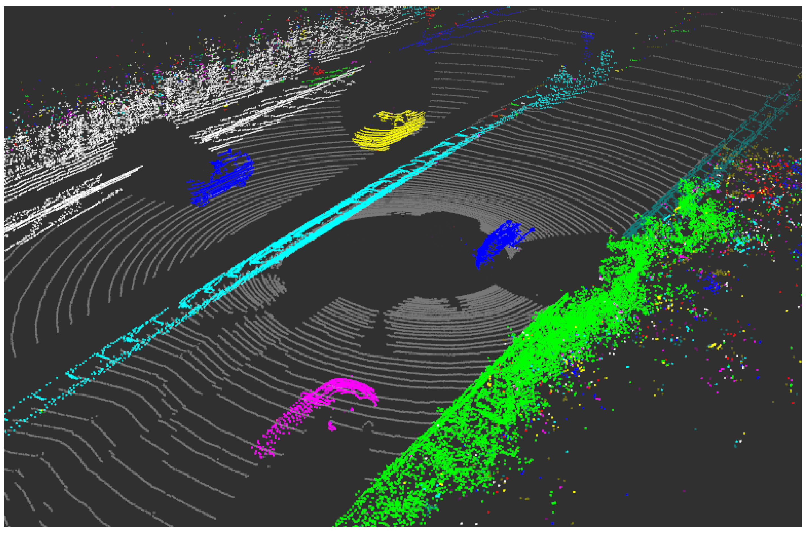

# Mapper-ToF-with-VIO

An open source project to make a 3D point cloud with a ToF camera using VIO to map of a room. Preferably relatively low-cost.
It probably wont work but ehhh if it works it works. Most of my work on the Nios II is based on what I did in my masters degree and with Quartus.
Probably will try to put it on a drone if it works who knows. 
This project is mainly to familiarize myself with Verilog/SystemVerilog, Quartus and FGPA overall and git.

## Project objectives

- Reading in real time the IMU / Mono camera with a ToF camera
- Synchronizing and data handling by the DE10 Lite FPGA
- Transfering data from FPGA to PC to handle the VIO and map in real time
- Generating the fused and interpolated 3D point cloud

Example of 3D could point from a ToF LiDAR taken from the internet

## Project Architectures

[IMU + mono + ToF] -> [Nios II / FPGA] -> [PC]

- **DE10-Lite / FPGA (Verilog)**: sensor acquisition, timestamping, transmission
- **Nios II processor (C++)**: IMU + Mono camera + ToF + I2C + UART + timer drivers  
- **PC (Python)**: VIO processing and 3D point cloud construction and interpolation

## Folder Structure

Mapper-ToF-with-VIO  
┣ Documentation --> Doc folder 
┃ ┗ DE10_Lite_User_Manual.pdf 
┣ FPGA --> Quartus project 
┣ Images 
┃ ┗ LiDARexample.png 
┣ PC --> VIO & Mapping 
┗ Software --> Nios II Source code 
  ┗