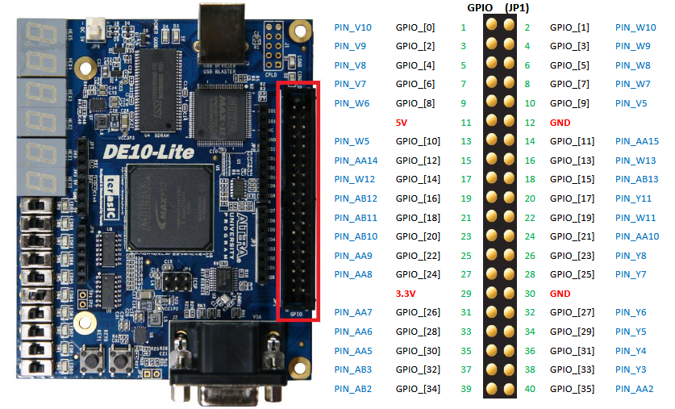

# Mapper-ToF-with-VIO

An open source project to make a 3D point cloud with a ToF camera using VIO to map of a room. Preferably relatively low-cost.
It probably wont work but ehhh if it works it works. Most of my work on the Nios II is based on what I did in my masters degree and with Quartus.
Probably will try to put it on a drone if it works and if I find how to send data over the air to my PC.  
This project is mainly to familiarize myself with Verilog/SystemVerilog, Quartus and FGPA overall and git.  
/!\ Note to self : remember to deactivate Memory integrity to enable Quartus USB-driver and let OpenCore open before uploading the bit stream /!\

## Project objectives

- Reading in real time the IMU / Mono camera with a ToF camera
- Synchronizing and data handling by the DE10 Lite FPGA
- Transfering data from FPGA to PC to handle the VIO and map in real time
- Generating the fused and interpolated 3D point cloud

Example of 3D could point from a ToF LiDAR taken from the internet

## Project Architectures

[IMU + mono + ToF] -> [Nios II / FPGA] -> [PC]

- **DE10-Lite / FPGA (Verilog)**: sensor acquisition, timestamping, transmission
- **Nios II processor (C++)**: IMU + Mono camera + ToF + I2C + UART + timer drivers  
- **PC (Python)**: VIO processing and 3D point cloud construction and interpolation

### DE10 Lite Expansion Header

For I2C I use the GPIO0 as SDA IN, the GPIO1 as SCL IN, the GPIO2 as SDA OE (output enable) and the GPIO 3 for SCL OE.
Both the SDA IN and the SCL IN are the reading head and the OE are the line drivers for I2C.  
For UART I use the GPIO34 as RxD and the GPIO35 as TxD

### Command needed on Nios2 Command Shell to upload code

For those commands you need to do a cd /cygdrive/c/Users/YourUsername/Mapper-ToF-with-VIO/FPGA_NIOS_Mapper/software/Software_NiosII or Software_NiosII_bsp.
You also need to be on a Nios2 Command Shell.

**make clean** -> clean folder you are currently on (example : on this project on Software_NiosII or Software_NiosII_bsp)  
**make build** -> build folder you are currently on only use on Software_NiosII and not on the bsp  
**nios2-download Software_NiosII.elf --go** -> Upload the program on the DE10 Lite only use on Software_NiosII  

## Folder Structure

PS : for the Quartus folder I only put the most important files

Mapper-ToF-with-VIO  
┣ **Documentation --> Doc folder**  
┃ ┣ DE10_Lite_User_Manual.pdf  
┃ ┗ ug_embedded_ip.pdf  
┣ **FPGA_NIOS_Mapper --> Quartus project**  
┃ ┣ Hardware_Qsys  
┃ ┃ ┣ synthesis  
┃ ┃ ┃ ┗ Hardware_Qsys.qip -> Used to import NIOS II on the schematic  
┃ ┃ ┗ Hardware_Qsys.bsf  
┃ ┣ **software --> Code for the Nios II**  
┃ ┃ ┣ Software_NiosII  
┃ ┃ ┃ ┣ include  
┃ ┃ ┃ ┃ ┣ hex.h  
┃ ┃ ┃ ┣ src  
┃ ┃ ┃ ┃ ┣ hex.c  
┃ ┃ ┃ ┃ ┗ main.c  
┃ ┃ ┃ ┗ Makefile  
┃ ┃ ┗ Software_NiosII_bsp  
┃ ┃ ┃ ┣ Makefile  
┃ ┃ ┃ ┗ system.h  
┃ ┣ DE10_LITE_Golden_Top.v  
┃ ┣ Hardware_Mapper.qpf  
┃ ┣ Hardware_Mapper.qsf  
┃ ┣ Hardware_Qsys.qsys -> Qsys for NIOS II  
┃ ┣ Hardware_Qsys.sopcinfo -> Base file for software  
┣ Images  
┃ ┗ LiDARexample.png  
┣ **PC --> VIO & Mapping**  
┃ ┗  
┣ .gitignore  
┣ LICENSE  
┣ README.md  
┗ todo.md  
